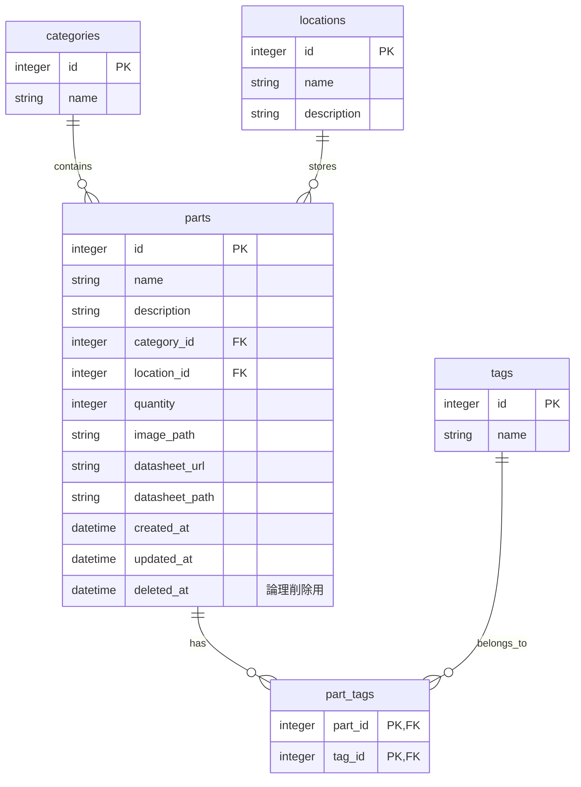

# データベース設計

データベースには **SQLite** を使用しています。
ファイルの実体は `server/database.sqlite` に保存されます。

## ER図 (概念)

## テーブル定義詳細

### `parts` (パーツ情報)
| カラム名 | 型 | 説明 |
| --- | --- | --- |
| `id` | INTEGER | 主キー (AUTOINCREMENT) |
| `name` | TEXT | パーツ名 (必須) |
| `description` | TEXT | 詳細説明 |
| `category_id` | INTEGER | `categories.id` への外部キー |
| `location_id` | INTEGER | `locations.id` への外部キー |
| `quantity` | INTEGER | 在庫数 (デフォルト: 0) |
| `image_path` | TEXT | アップロードされた画像のパス (`/uploads/...`) |
| `datasheet_url` | TEXT | 外部データシートURL |
| `datasheet_path` | TEXT | アップロードされたPDFのパス (`/uploads/...`) |
| `created_at` | DATETIME | 作成日時 |
| `updated_at` | DATETIME | 更新日時 |
| `deleted_at` | DATETIME | 削除日時 (NULLなら有効、日時が入っていればゴミ箱) |

### `categories` (カテゴリマスタ)
| カラム名 | 型 | 説明 |
| --- | --- | --- |
| `id` | INTEGER | 主キー |
| `name` | TEXT | カテゴリ名 (例: Resistors, ICs) |

### `locations` (保管場所マスタ)
| カラム名 | 型 | 説明 |
| --- | --- | --- |
| `id` | INTEGER | 主キー |
| `name` | TEXT | 場所名 (例: Box A) |
| `description` | TEXT | 場所の説明 |

### `tags` (タグマスタ)
| カラム名 | 型 | 説明 |
| --- | --- | --- |
| `id` | INTEGER | 主キー |
| `name` | TEXT | タグ名 (UNIQUE) |

### `part_tags` (中間テーブル)
パーツとタグの多対多関係を管理します。
| カラム名 | 型 | 説明 |
| --- | --- | --- |
| `part_id` | INTEGER | `parts.id` への外部キー |
| `tag_id` | INTEGER | `tags.id` への外部キー |
-   複合主キー: `(part_id, tag_id)`
-   `ON DELETE CASCADE` により、親データ削除時に自動的に紐付けも削除されます。
